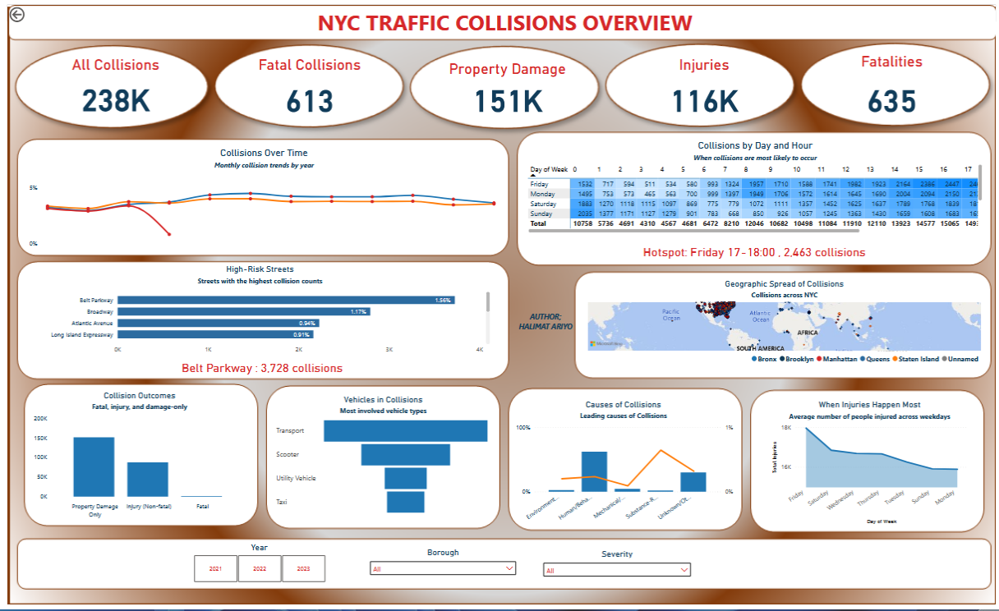
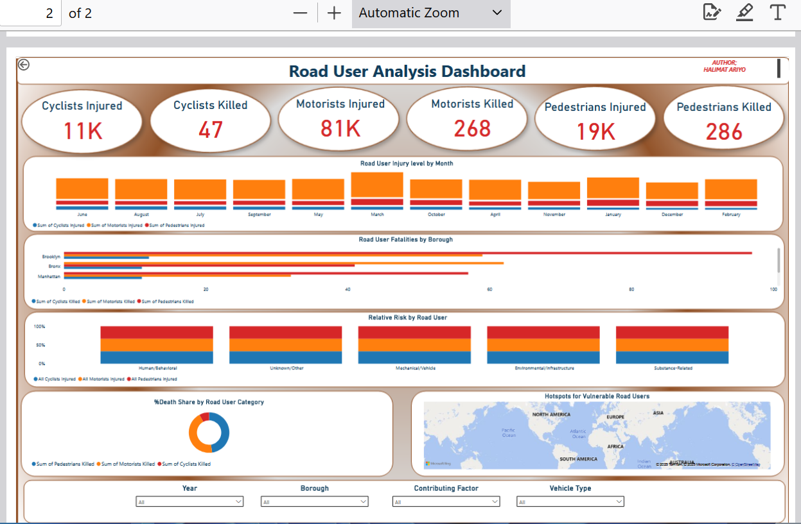

# NYC Traffic Collisions 


## Executive Summary
This project analyzes New York City traffic collisions to uncover **when, where, and why accidents happen, and who is most affected**.  

Two Power BI dashboards were developed:  
1. **Collisions Overview** — KPIs, seasonal trends, time-of-day hotspots, top streets, and contributing factors. ** **
2. **Road User Impact** — injuries and fatalities across pedestrians, cyclists, and motorists. ** ** 

Key insights: Over **2,400 collisions in a single peak hour** (Friday 17:00–18:00), **human error/distraction** as the leading cause, and **Brooklyn** as the most impacted borough. These findings provide actionable evidence for **policy makers and urban safety planning**.


##  Dashboards
1. **NYC Traffic Collisions Overview** — KPIs • Seasonality • Day×Hour Heatmap • Top Streets • Contributing Factors  
2. **Road User Impact** — Injuries & Fatalities by Pedestrians/Cyclists/Motorists • % Shares • Hotspots

##  Repo Structure
```
.
├── assets/
│   ├── repo-banner.png
│   ├── backgrounds/
│   │   ├── NYC_Collisions_Dashboard_Background_1920x1200*.png
│   │   └── Road_User_Impact_Dashboard_Background_1920x1200*.png
│   └── screenshots/ 
├── data/              
├── docs/              
├── pbix/Nyc_collisions.pbix          
├── powerbi/
│   └── nyc_collisions_powerbi_theme.json
├── .gitignore
├── LICENSE (MIT)
└── README.md


##  Key Visuals (Overview page)
- **KPIs:** Total Collisions • Total Injuries • Total Fatalities • Fatal Collisions • % Fatal • PDO.
- **Q1 Seasonality:** Line/Column — *Monthly collision trends by year*.
- **Q2 Heatmap:** Matrix — *Collisions by Day and Hour* (+ hotspot callout measure).
- **Q3 Top Streets:** Bar — Top 10 streets with counts + % of total.
- **Q4 Causes:** Two bars or combo chart — *All collisions vs Fatal collisions* by factor/category.

##  Key Visuals (Road User Impact page)
- **KPIs:** Injured/Killed by Pedestrian, Cyclist, Motorist.
- **Injuries Breakdown:** Stacked column by Month/Borough.
- **Fatalities Breakdown:** Clustered bar by Borough/Factor.
- **% Share:** 100% stacked bar — *Relative risk by road user*.
- **Hotspots:** Borough bubble map (or point map if you keep Lat/Long).

##  Core Measures (DAX — examples)
```DAX
Total Collisions = COUNTROWS(NYC_Collisions)
Total Injured    = SUM(NYC_Collisions[Persons Injured])
Total Fatalities = SUM(NYC_Collisions[Persons Killed])

Fatal Collisions =
CALCULATE ( [Total Collisions], NYC_Collisions[Persons Killed] > 0 )

% Fatal Collisions =
DIVIDE ( [Fatal Collisions], [Total Collisions], 0 )
```

##  Data
Data Source: " NYC Open Data (Motor Vehicle Collisions dataset)”
- NYC collisions (https://docs.google.com/spreadsheets/d/1huf7nbHNZdzr4N6QUvURxeWU-G27KSYU3Kl3v_heXgw/edit?usp=sharing)


